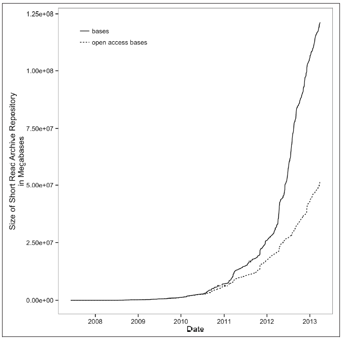
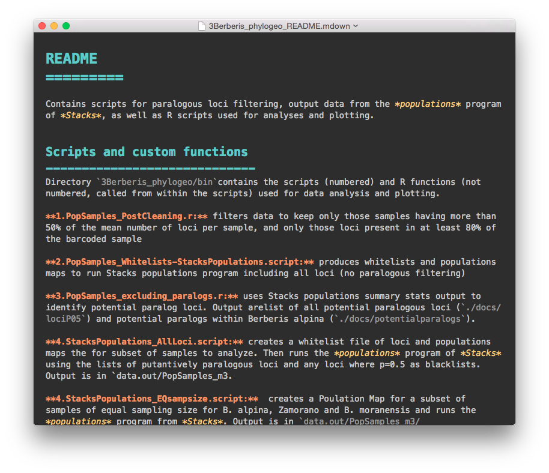

# 1. Bioinformática e investigación reproducible 
===============================================================================

Texto original de Alicia Mastretta (legal!!)
Github: https://github.com/AliciaMstt/BioinfInvRepro2016-II.git

===============================================================================

## Biología y computadoras:

* **Biología Computacional**: estudio de la biología utilizando cómputo. Su objetivo es generar conocimiento biológico. 
    * Utilizar las herramientas hechas por alguien más para contestar tus preguntas.

* **Bioinformática**: creación de herramientas (algoritmos, software) para solucionar problemas con datos biológicos. 
    * Generar tus propias herramientas para contestar tus preguntas.


Como biólogo/as evolutivos utilizamos ambas:

 La mayoría de la investigación que se publica recientemente utilizó una mezcla de los programas de alguien más (sobretodo en los primeros pasos del procesamiento de datos) y después se utilizan **funciones**  propias para realizar análisis más específicos. 

Este curso empieza por biología computacional y deriva en la posibilidad de que crees tu propio código para analizar tus datos. 

Aunque la Biología Computacional y la Bioinformática no son lo mismo, tienen mucho en común y se apreden juntas. De aquí en adelante me referiré a análisis bioinformáticos, pero implica ambos tipos de disciplinas.


## 1.1. Reproducibilidad y documentación de análisis bioinformáticos


#### Investigación reproducible
Hacer **investigación reproducible** es poder repetir y obtener los mismos resultados de un trabajo científico. Para esto es necesario **que el producto de la investigación incluya**:

* Artículo científico (o tesis),
* Descripción de materiales y métodos,
* Datos utilizados,
* Código de cómputo utilizado,
* Versión del software utilizado,
* Cualquier otra información necesaria para repetir los experimentos y análisis


#### Reproducibilidad en bioinformática 
* Datos genéticos: 
    * Big Data
    * Mucha información, y creciendo

*Crecimiento del Short Read Archive. Tomado de Buffalo (2015)*

    * Requieren procesamiento intermedio de datos crudos a los datos en las figuras.
* Análisis de datos genéticos requieren forzosamente bioinformática y/o biología computacional. 
* Por lo tanto:
   - Depeden de software especializado 
   - Sus resultados pueden varias dependiendo de las (muchas) opciones y parámetros utilizados
   - La descripción en "Métodos" no basta para poder repetir el análisis
* **El código** 
   - Es indispensable para poder **repetir** y **mejorar** los análisis 
   - Puede arrojar errores "silenciosos" que sin embargo afecten significativamente los resultados

* Dos reglas de la bioinformática:
   - Si entra basura, basura sale.
   - Jamás de los jamaces confíes en tus herramientas (*The Golden Rule of Bioinformatics* de Buffalo).

 
#### ¿Reproducible para quién?

**1. Quién hizo la investigación, 6 meses (ó 6 días) después**

Evitar:

* ¿Cómo chingaos era esto?
* El archivo bueno es final.xlsx. No, espera, tal vez sea final_elbueo.xlsx. Deja reviso la última fecha de modificación. Hum....
* Ahorita me acuerdo.

Ganar:

* Volver a correr fácilmente los mismos datos con pequeñas modificaciones a los parámetros o datos input.
* Reutilizar código o datos para nuevos análisis
* Confianza en tus resultados

**2. Tus colegas y asesor/a**

No temer decir que sí a:

* ¿Me ayudas a hacer este análisis?
* ¿Puedes repetir esta gráfica agregando este dato nuevo? 

**3. La comunidad científica**

* Corroborar resultados
* Construir sobre lo construido

## 1.2. Repositorios de datos

### ¿Materiales suplementarios?

Contras:

* Limitación de tamaño (MB) o número de archivos
* Complicados para conjuntos de datos grandes y de formatos específicos
* Oscuros y difíciles de rastrear y citar


### Especializados en datos genéticos
* [NCBI Gene Bank](http://www.ncbi.nlm.nih.gov/genbank/). Banco de datos genéticos desde la secuenciación Sanger. Seguor ya lo conocen.
* [Sequence Read Archive (SRA)](http://www.ncbi.nlm.nih.gov/sra). Rama de NCBI dedicada a datos de secuenciación masiva. 
* [BOLD](http://www.boldsystems.org/). Dedicado a datos del "barcode de la vida".
* Y varios más 


### Dryad
[Dryad Digital Repository](http://datadryad.org/) es un repositorio de datos digitales de *cualquier tipo* siempre y cuando sean parte de una publicación científica. 

Acepta archivos excel, scripts, alineamientos de secuencias de ADN, datos semi-crudos y cualquier archivo digital que sea necesario para repetir una investigación.

Muchas revistas científicas piden como requisito que los datos estén en Dryad además de en NCBI o símil.


### Otros
Checa otros repositorios de datos [aquí](http://ropensci.github.io/reproducibility-guide/sections/dataStorage/).


### Artículos de datos
Son artículos enfocados en describir un **set de datos**, incluyendo todos los aspectos técnicos y formatos para que puedan ser fácilmente reutilizados. 

Ejemplos:

* [Scientific data](http://www.nature.com/sdata/about/principles)

* [Genomics Data](http://www.journals.elsevier.com/genomics-data/)

### Un buen README 

* "Leeme".
* Un archivo de texto (no Word, pero puede ser MarkDown) que detalla:
   * **Qué hay** dentro del repositorio (y cada uno de sus directorios).
   * **Qué hacen** cada una de las funciones/scripts del repositorio
   * **Cómo y en qué órden** deben ocuparse los scripts para realizar los análisis
* Ejemplo:
    * [Este](http://datadryad.org/resource/doi:10.5061/dryad.n3jk5
) repositorio de datos está dividido en varias secciones. La 3ra se ve así:


Y si abres el README.mdwon verás algo así (los colores y el fondo negro son porque lo abrí con el editor MacDown, pero es un vil archivo de texto):

 

## 1.3. Código en computación

* Instrucciones escritas **para una computadora** en un **lenguaje de cómputo**   
* Paso por paso hasta una solución.
* El código es uno o varios **archivos de texto** (¡NO WORD!, *plain text*).
* El código puede ser muy largo y formar un programa (**software**) entero o de una sóla línea para realizar una única operación.
* Escribir código para que lo ejecuten las computadoras y **comentado** para seres humanos.


## 1.4. Scripts y repositorios de código

Un **script** es un archivo de nuestros análisis que es:

* un archivo de texto plano (**¡¡NO WORD!!**)
* permanente,
* repetible,
* antoado,
* compartible y 
* compatible con otras plataformas

En otras palabras, un script es una recopilación por escrito de las instrucciones que queremos que la computadora corra, de modo que al tener esas instrucciones cualquiera pueda repetir el análisis tal cual se hizo. 

El script consta de dos tipos de texto: 

**1.** El **código** (comandos) que queremos que se ejecute, en el órden que queremos que lo ejecute.

Es decir lo mismo que escribiríamos en la Terminal para hacer un análisis, pero guardado en un archivo de texto que tiene todos los comandos juntos y que podemos abrir para **repetir** o **compartir** el análisis.

**2.** Comentarios escritos **para un ser humano** en un **lenguaje de humanos**, dígase no solo en español, sino que nos permita entender qué hace el código, qué tipo de información requiere y cualquier otra cosa que una persona cualquiera necesite para poder utilizar el código del script de forma correcta.


Para que la computadora distinga entre el código y los comentarios para humanos se utiliza el símbolo `#`. Todo el texto a la *derecha* del símbolo `#` será ignorado por la computadora, aunque sí "se imprima" en la Consola. 

Por ejemplo, el texto siguiente es un estracto de un script para correr Admixture:

```
# run admixture using K=3  multithreaded mode, fixed random seed and bootstraping to estimate standar erros.
cd ../admixture
./admixture_macosx-1.23/admixture ../data/SNPs/nuevos_final.bed 3 -j4 -s 21 -B
```


### ¿Por qué compartir nuestro código?

* Reproducibilidad de la cienica
* Construir sobre lo construído y hacer mejor el código antes. Más en el artículo: 
 [Openness makes software better sooner](http://www.nature.com/news/2003/030623/full/news030623-6.html)

### Excusas comunes para no compartir nuestro código
* Me da pena que vean mi código
* No quiero que otros saquen provecho de mi código, me pertenece o a mi institución
* Otros no publican su código ¿por qué yo sí?
* Me da flojera pulir mi código para publicarlo
* Si publico mi código le van a encontrar errores y demandar correcciones o ayuda

Si respondiste sí (o tus colaboradores) a cualquiera de los anteriores checa esta lectura recomendada: [Publish your computer code: it is good enough](http://www.nature.com/news/2010/101013/full/467753a.html) de Nick Barnes.


### ¿Cómo compartir código?

* Scripts **comentados** y con un **README**
* Repositorio de código
   * Dryad (como parte del repositorio de datos)
   * [GitHub](https://github.com/) (mejor para funciones y projectos que continuarán actualizándose).


### GitHub
 
Es un repositorio de código que:

* Utiliza `git` para llevar un sistema de **control de versiones**,
* Tiene una interfase Web pública,
* Se puede bajar como una aplicación de escritorio, 
* Permite escribir/revisar código en equipo
* Su símbolo es un gatopulpo. 


<div style="page-break-after: always;"></div>
