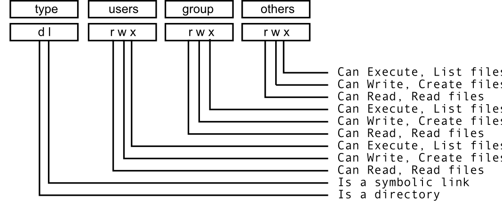

# 2. Algoritmos y programación

En esta parte veremos cómo escribir *scripts* para resolver algoritmos a través de código de cómputo. 

Comencemos por 

## 2.1. Lógica de la ejecución de un algoritmo

### Algoritmos

En programación, un algoritmo es:

* Un procedimiento bien definido, con un inicio y un final claros, que le permite a una computadora resolver un problema.
* Una secuencia inequívoca (sin lugar a interpretaciones subjetivas) de instrucciones.

Los algoritmos **no** son código de cómputo, sino una división por pasos para solucionar un problema.  

Ejemplo:


*Algoritmo para sumar dos variables*

```
Paso 1: Inicio
Paso 2: Declarar las variables num1, num2 y suma. 
Paso 3: Leer las variables num1 y num2. 
Paso 4: Agregar num1 y num2 y asignar el resultado a suma.

        suma←num1+num2 

Paso 5: Mostrar suma
Paso 6: Fin
```

Un ejemplo bioinformático:

*Algoritmo para obtener datos RADseq:*

```
Paso 1: Inicio
Paso 2: Obtener secuencias raw en formato FASTQ 
Paso 3: Descartar secuencias de baja calidad
Paso 4: Demultiplexear secuencias por individuo
Paso 5: Realizar ensamblado de novo
Paso 6: Genotipificar individuos(GBS/RADseq)
Paso 7: Mostrar matriz de genotipos por individuos
Paso 7: Fin
```

**Utilidad**

Tener claro el algoritmo con el que solucionaremos un problema nos ayuda a después escrbir el código para realizar cada paso.

### Algoritmos y scripts

Como vimos hace rato, un **script** es:

* un archivo de texto plano (**¡¡NO WORD!!**)
* permanente
* repetible
* antoado
* compartible  
* compatible con otras plataformas

El script consta de dos tipos de texto: 

1. El **código** (comandos) que queremos que se ejecute, en el órden que queremos que lo ejecute. O sea que un script es una **serie de comandos que siguen la lógica de un algoritmo**.

2. Comentarios escritos **para un ser humano** en un **lenguaje de humanos** (SUPER IMPORTANTE, puede salvarte en muchas ocasiones).

Una buena forma de escribir un script es:

1. Escribir el algoritmo, es decir los pasos que queremos hacer.
2. Marcar dichos pasos como comentarios (recuerda el uso de `#` para indicar que el texto a su derecha es un comentario, no un comando).
3. Escribir el código para hacer cada paso debajo del comentario correspondiente. 

Ejemplo:

* Algoritmo para guardar secuencias de *Chiropterotriton*
 
```
Definir secuencias a bajar desde NCBI
Crear directorio para guardar datos
Bajar datos al directorio deseado
Revisar secuencias
Fin
```

* Algoritmo + código para bajar secuencias de *Chiropterotriton*:

```
## Este script baja 3 secuencias de Chiropterotriton de NCBI
# Crear directorio para guardar datos
mkdir Chiropt

# Bajar datos de NCBI 
curl -s "http://eutils.ncbi.nlm.nih.gov/entrez/eutils/efetch.fcgi?db=nucleotide&rettype=fasta&id=937202862,937202860,937202858" > Chiropt/ranas.fasta

# Revisar qué secuencias se bajaron
grep ">" Chiropt/ranas.fasta
```

**Observación**: una ventaja de los scripts es que nos permiten tener en un solo documento *varios* comandos que se utilizaron para hacer algo, es decir, conforme se complican los análisis necesitamos más de una línea de comando para realizarlos.


## 2.2. Modularidad

La *programación modular* se refiere a subdividir un programa de cómputo en varios sub-programas separados.

Ventajas: 

* Es más fácil leer (y escribir) el código.
* Permite revisar el output de pasos complejos antes de enviarlos al siguiente paso.
* Si algo falla es más fácil identificar qué fue.
* Permite tener más de una opción de programas para realizar el análisis completo (e.g. demultiplexeo en un programa, alineación en otro).
* Permite volver a correr las partes del proceso que queremos, y no toooodo desde el inicio otra vez.

A la secuencia completa de módulos necesarios para completar un análisis se le conoce como **pipeline** (de ahí el nombre del símbolo **|**).

Veamos por ejemplo los [componentes del programa Stacks](http://catchenlab.life.illinois.edu/stacks/manual/#comps), que es uno de los softwares más populares para analizar datos RADseq:


No solamente los programas bioinformáticos pueden pensarse modularmente, sino también **cualquier análisis** que involucre varios pasos complejos. De modo que en vez de tener un único script que lo haga todo, podemos tener uno por cada paso importante, y correrlos de forma independiente (para probarlos o repetir sólo un paso) o correrlos todos en una sola sentada con un script que ejecute todo el *pipeline* paso por paso. 


## 2.3. Cómo organizar un script

Ya hemos visto que un script es un archivo de texto con código y comentarios. Esta es una generalidad cierta para cualquier lenguaje de programación (aunque los comentarios no son obligados). 

Sin embargo los scripts que corremos desde la Terminal Unix, es decir scripts de *Bash* o *Shell* requiren de 3 pasos para **convertirse en software**:

1. Escribir los comandos a un archivo de texto (escribir el script).
2. Indicarle al sistema operativo (computadora) que programa (lenguaje) debe utilizar para *interpretar* los comandos
3. Darle al *archivo* los *permisos* que necesita para poder ser *ejecutado por Shell*. 

### Escribir el script

Escribir un script es escribir en un **editor de texto** los comandos para resolver un problema, de preferencia comentando cada paso.

Editores de texto recomendados:

* Windows: [Notepad++](https://notepad-plus-plus.org/) (Sublime)
* Mac: [TextWrangler](http://download.cnet.com/TextWrangler/3000-2351_4-10220012.html) o [Fraise](http://www.macupdate.com/app/mac/33751/fraise) (Sublime)
* Linux: [Gedit](http://sourceforge.net/projects/gedit/) (Sublime)

El ejemplo que vimos antes, escrito en TextWrangler se ve así:


La terminación `.sh` indica que es un archivo Shell (es decir el interpretador de la Terminal, equivalente a decir Bash, recordemos la Unidad 1). Y al darle esta terminación de archivo, o señalar el tipo de lenguaje en el menú de opciones, el editor de texto nos ayuda a leer el código coloreando los comandos, los flags, las variables y los comentarios. 

Sin embargo este script **aún no está listo**.

### Indicar con qué programa *interpretar* el script: `#!`

**`#!`** Se lee cómo "Shebang". 

Se pone en la **primera línea** de un script seguido del nombre (path) del programa (lenguaje, para bash `/bin/bash`) con el que está escrito el script, para indicarle a la computadora que debe interpretar el script en dicho 
lenguaje. 

Memotecnica: *She bangs* de Ricky Martin. 

**Ojo**: el shebang **no** es un comentario aunque empiece con `#`, pues en realidad el símbolo `#!` considera a los caracteres `#` y `!` juntos. 


Por ejemplo, para decir que estamos escribiendo un script de Bash que queremos correr en la Terminal la primera línea tendría que decir:

```
#! /bin/bash
```
Ejemplos en otros lenguajes:

```
#! /usr/bin/env python
```

Nuestro script entonces se verá así:


En este momento ya podemos correr nuestro script. Sólo hay que ir a la Terminal, `cd` al directorio donde esté nuestro script y utilizar el comando `bash`:

```
$ bash getsecsNCBI.sh 
>gi|937202862|gb|KT820711.1| Chiropterotriton sp. SMR-2015b voucher MVZ:Herp:269665 cytochrome b (cytb) gene, partial cds; mitochondrial
>gi|937202860|gb|KT820710.1| Chiropterotriton sp. SMR-2015a voucher IBH:28182 cytochrome b (cytb) gene, partial cds; mitochondrial
>gi|937202858|gb|KT820709.1| Chiropterotriton sp. SMR-2015a voucher IBH:28178 cytochrome b (cytb) gene, partial cds; mitochondrial

```

`bash` es un comando que a su vez ejecuta comandos de un stdinput o de un archivo, en este caso nuestro script.

Sin embargo, si **hacemos el archivo ejecutable** ya no será necesario ejecutarlo a través de bash, ya que será un *programa* por sí mismo. 

**NOTA IMPORTANTE**: el workingdirectory de un script es siempre el directorio donde está guardado dicho script. Entonces, es importante que si tu script va a manejar directorios (`cd` a algún lugar) lo planees todo empezando en el directorio donde guardarás el script. ¿Dónde es un buen lugar para guardar el script? Lo veremos con detalle en otra unidad, pero en resumen el mejor lugar es en el mismo directorio que los datos, o en uno muy cercano. 

### Hacer ejecutable el archivo

`ls -l` nos da información extendida de los archivos, incluyendo los *permisos*.

Por ejemplo: 

```
$ ls -l 
total 8
drwxr-xr-x  3 ticatla  staff  102 13 Feb 23:09 Chiropt
-rw-r--r--@ 1 ticatla  staff  350 13 Feb 23:05 getsecsNCBI.sh

``` 

Veamos cómo leerse (imagen cortesía de [aquí](https://www.samba.org/samba/docs/man/Samba-HOWTO-Collection/AccessControls.html)):

.

`chmod` es el comando para cambiar estos permisos, lo cual nos permite volver un archivo ejecutable:

```
$ chmod u+x getsecsNCBI.sh
$ ls -l
total 8
drwxr-xr-x  3 ticatla  staff  102 13 Feb 23:09 Chiropt
-rwxr--r--@ 1 ticatla  staff  350 13 Feb 23:05 getsecsNCBI.sh
```

¿Notas que ahora dice -rwxr? La nueva x quiere decir que ahora el archivo es un ejecutable, para correrlo:

```
$ ./getsecsNCBI.sh
>gi|937202862|gb|KT820711.1| Chiropterotriton sp. SMR-2015b voucher MVZ:Herp:269665 cytochrome b (cytb) gene, partial cds; mitochondrial
>gi|937202860|gb|KT820710.1| Chiropterotriton sp. SMR-2015a voucher IBH:28182 cytochrome b (cytb) gene, partial cds; mitochondrial
>gi|937202858|gb|KT820709.1| Chiropterotriton sp. SMR-2015a voucher IBH:28178 cytochrome b (cytb) gene, partial cds; mitochondrial
```

