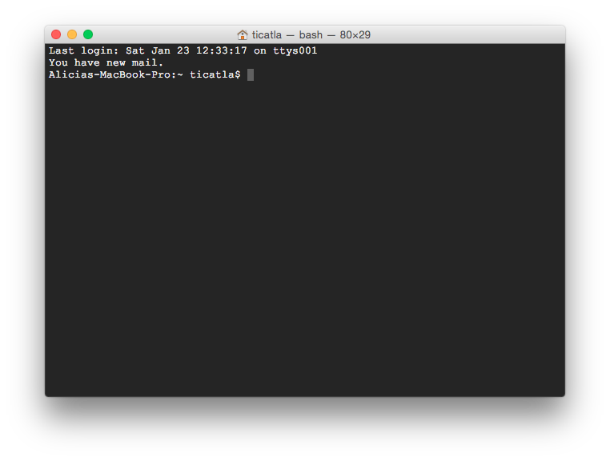
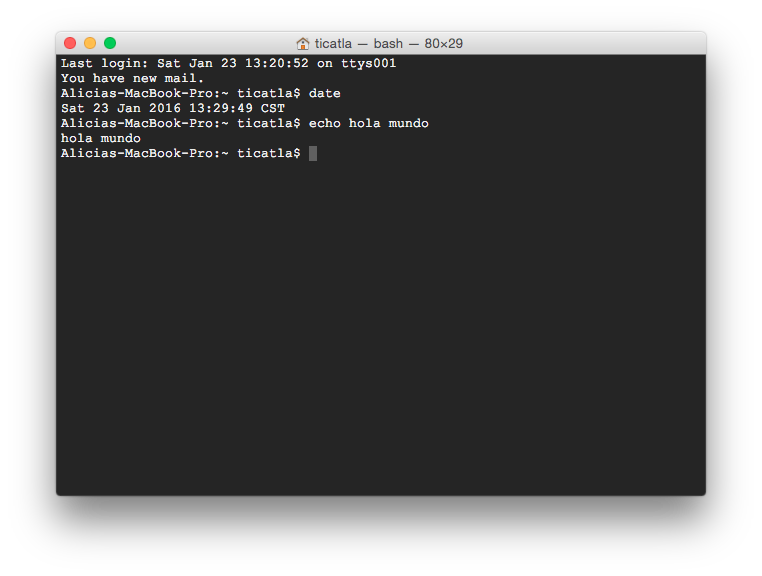
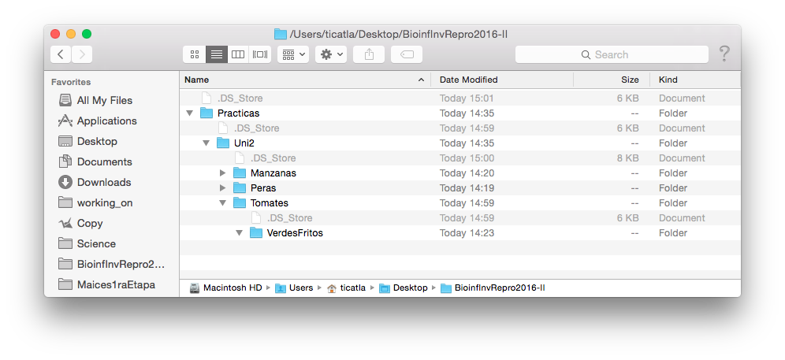

# 3.Introducción a Unix Shell

## 3.1. Introducción a la Consola y Línea de Comando


La terminal y Unix

En tu terminal verás algo así:



La primera línea dice la fecha y hora y "ttys001". ttys viene de "Teletype" ([un poco de historia aquí](http://stackoverflow.com/questions/4532413/what-is-tty-on-freebsd)) y significa que el *input* es nuestro teclado, identificado como ttys001. 

En mi caso la segunda línea me dice que tengo correo. Uds probablemente no tengan esto.

La tercera línea es la más importante: dice el **nombre del equipo** (Aliicas-MacBook-Pro en este caso), el **directorio** donde estoy (`~` significa "home directory", lo veremos más adelante) y el **nombre del usuario** con quién estoy en la terminal (en mi caso ticatla). 

Notarás que la tercera línea termina en `$`

`$` significa que la terminal está corriendo con un interpretador Shell o Bash y por un usuario sin mayores privilegios. Si termina en `#` significa que la estás corriendo como **root** que es un "súper usuario" con permisos para desconfigurarlo todo, ten cuidado. 


#### ¿Qué significa que La Terminal tenga un interpretador? 

Que le damos comandos y nos responde. 

El la Terminal no existe el *point and click*. El que funcione como una Línea de Comando significa que tienes que darle comandos de qué hacer línea por línea. 

Por ejemplo:

`date` nos responde la fecha actual

`echo algo` nos responde el texto "algo". También lo puedes utilizar con más de una palabra. 

Algo así debe verse tu terminal:



Pero por practicidad y para facilitar el copiar-pegar en vez de la imágen de la Terminal pondré los comandos (código) y sus resultados, así:

```
Alicias-MacBook-Pro:~ ticatla$ date
Sat 23 Jan 2016 14:46:06 CST
Alicias-MacBook-Pro:~ ticatla$ echo algo
algo
Alicias-MacBook-Pro:~ ticatla$ echo hello world
hello world
```

Que es lo mismo que:

```
$ date
Sat 23 Jan 2016 14:46:06 CST
$ echo algo
algo
$ echo hello world
hello world
``` 
 
Para facilidad visual, de aquí en adelante utilizaremos la opción con el texto a partir de `$` (al menos que sea pertinente ver lo que hay antes). Este tipo de formato te lo encontrarás en diversos foros de ayuda, libros de textos y manuales.
 

**Pregunta**: ¿Qué pasa si intentas correr el comando  `algo`?:

La terminal dirá:

    -bash: algo: command not found

Que quiere decir que no existe el comando `algo`. 


## 3.2. Funciones básicas de navegación y manejo de archivos y directorios

Windows, Mac y las interfaces gráficas de Linux (como Ubuntu y Biolinux) tienen un sistema de archivos que estamos acostumbrados a explorar a través carpetas y subcarpetas que podemos ver en una ventana. Por ejemplo así:

 

A continuación vamos a ver cómo navegar por este **mismo** sistema de archivos, pero desde la Terminal y con el teclado en vez de desde una ventana y con clicks.

### `pwd`

`pwd` nos da el directorio en donde estamos (viene de print **working directory**). 

El directorio de trabajo es **dónde estamos**, equivalente a tener una ventana abierta del explorador en una carpeta determinada. Al menos que le indiques lo contrario, todo archivo que se genere como parte de la ejecución de un programa se guardará aquí. También este será el lugar donde cualquier programa/script buscará los archivos que le pidas, y NO los encontrará si no están exactamente ahí. Claro que es posible decirle que busque en otro directorio, lo veremos adelante.  

El working directory de base es la carpeta "home" del usuario de la computadora. En mi caso:

    $ pwd
    /Users/ticatla
 
La diagonal **/** es el símbolo que separa los directorios en niveles jerárquicos. Es decir `ticatla` es un subdirectorio de `Users` que a su vez es un subdirectorio de `root` (simbolizado aquí como una sola /), la raíz de todos los directorios.

### `cd`

`cd` viene de **change directory** y sirve para movernos a otro directorio. Para esto hay varias opciones:

#### Moverse hacia adelante/abajo (i.e. adentro de subdirectorios):

* **Absolute path** que es dar la ruta (dirección) completa **desde root** hasta el directorio que queremos.

* **Relative path** que es dar la ruta **desde donde estamos** hasta el directorio que queremos.

Ejemplo de ruta absoluta:

```
Alicias-MacBook-Pro:~ ticatla$ cd /Users/ticatla/Desktop/BioinfInvRepro2016-II/Practicas/
Alicias-MacBook-Pro:Practicas ticatla$

```
**Pregunta:** ¿Qué pasa con el texto antes del nombre de usuario?

Como se explicó antes, el texto antes de `$` nos indica el nombre del equipo, el directorio actual y el nombre del usuario. El directorio actual cambió de "ticatla" (home) a "Practicas". 


#### Moverse a home:

`~` es una especie de ruta corta a la ruta absoluta de tu directorio home. No importa dónde estés `cd ~` te llevará a home. 


```
Alicias-MacBook-Pro:Practicas ticatla$ cd ~
Alicias-MacBook-Pro:~ ticatla$ 
```

Ejemplo de ruta relativa:

```
Alicias-MacBook-Pro:Practicas ticatla$ cd ~
Alicias-MacBook-Pro:~ ticatla$ cd Desktop/BioinfInvRepro2016-II/Practicas/
Alicias-MacBook-Pro:Practicas ticatla$ 
```

#### Moverse para atrás (hacia el directorio raíz):

Igual puede ser con rutas absolutas o relativas, pero utilizando `..` que representa **parent directory**, es decir el directorio arriba (o atrás, como le entiendas mejor):

`cd ..` por lo tanto te lleva a un directorio arriba de donde estés.

Ejemplo:


```

$ pwd
/Users/ticatla/Desktop/BioinfInvRepro2016-II/Practicas
$ cd ..
$ pwd
/Users/ticatla/Desktop/BioinfInvRepro2016-II


```

#### Moverse para atrás y para adelante en la misma línea

Puedes usar `..` muchas veces. Ojo con incluir `/` para separar niveles. 

Ejemplo:

```
$pwd
/Users/ticatla/Desktop/BioinfInvRepro2016-II/Practicas/Uni2/Tomates/VerdesFritos
$ cd ../../Manzanas/
$ pwd
/Users/ticatla/Desktop/BioinfInvRepro2016-II/Practicas/Uni2/Manzanas

```

Es decir `../` se puede combinar con una ruta relativa. Ejemplo:

```
$ pwd
/Users/ticatla/Desktop/BioinfInvRepro2016-II/Practicas/Tomates/VerdesFritos
Alicias-MacBook-Pro:VerdesFritos ticatla$ cd ../../Manzanas
Alicias-MacBook-Pro:Manzanas ticatla$ 
```

#### No moverse
O en otras palabras ir al directorio donde ya estás. Suena inútil, y en general lo es si lo hace con `cd`, pero el concepto es importante para otros comandos que veremos más adelante. 

`cd ./` te lleva al directorio en el que estás. Lo importante a recordar es que `.` significa "el directorio actual". 


#### Errores comunes al usar `cd`


* `-bash: cd: manzanas: No such file or directory`

 ¿Escribiste bien Manzanas? Ups. No. Es Manzanas no manzanas. Ojo con las mayúsculas. También aguas con  los errores de dedo (e.g. Manzaanas arrojaría el mismo error)

* `-bash: cd: ../Manzanas: No such file or directory`


  Sí está bien escrito, el directorio Manzanas existe y no lo encuentra. Ok, existe, pero NO en el directorio inmediatamente arriba. Checa dónde estás y a dónde dirigen tus `cd ..`

* `-bash: cd..: command not found`. 
  
  Ojo, con tus espacios `cd..` no es lo mismo que `cd ..`. Otro clásico es poner `cd ...`


En resumen: checa que esté bien escrito y que puedas ir a ese directorio con la ruta que le estás pidiendo. 

#### Tips de acceso rápido en la Terminal

**Flecha arriba/abajo** para acceder a los últimos comandos utilizados
**TAB** para "completar" la escritura del path o nombre de archivos.


### `ls`

Enlista los archivos y directorios presentes en un directorio. Ejemplo:

```
$ cd Maiz
$ ls
nuevos_final.bed	nuevos_final.fam
nuevos_final.bim	nuevos_final.log
```

Nota que los enlista en orden alfabético. 

Para tener más info de los archivos:

`ls -l` brinda la misma lista, pero con datos sobre: 
si es un directorio (d) o un archivo (-), permisos (si es sólo lectura, editable, etc y por quién, detalles más adelante), número de links al archivo, qué usuario es el dueño, a qué grupo pertenece dicho usuario, tamaño en bytes, fecha-hora en que se modificó y el nombre del directorio o archivo.

Ejemplo:

```
$ ls -l
total 5216
-rwx------  1 ticatla  staff  1551105  6 May  2015 nuevos_final.bed
-rwx------  1 ticatla  staff  1109078  6 May  2015 nuevos_final.bim
-rwx------  1 ticatla  staff     3604  6 May  2015 nuevos_final.fam
-rwx------  1 ticatla  staff     1825  6 May  2015 nuevos_final.log

```

Pero se pueden ordenar por fecha (y hora, aunque no se vea) de modificación, por ejemplo:

```
$ ls -lt
total 5216
-rwx------  1 ticatla  staff     1825  6 May  2015 nuevos_final.log
-rwx------  1 ticatla  staff     3604  6 May  2015 nuevos_final.fam
-rwx------  1 ticatla  staff  1551105  6 May  2015 nuevos_final.bed
-rwx------  1 ticatla  staff  1109078  6 May  2015 nuevos_final.bim
```


`man ls` abre el manual de `ls` (**o de cualquier otro comando**), donde vienen muchas más opciones para usar este comando.

**Tip**: presiona "q" para salir de la pantalla de `man`. 

**Ejercicio**:
* Enlista el contenido de `Maiz` por tamaño del archivo y has que el tamaño del archivo se lea en KB y MB (ie reducido en vez de todos los bytes).

### `mkdir`

Crea un directorio. 

```
$ mkdir Prueba
$ ls
Prueba			nuevos_final.bim	nuevos_final.log
nuevos_final.bed	nuevos_final.fam
```

Nota: Se puede combinar con paths absolutos o relativos para crearlo en un directorio diferente al WD.


**Ejercicio:** ¿Qué pasa si intentas crear un directorio que ya existe? ¿Para qué sirve el flag `-p`?


### `cp`

Copia un archivo o directorio de lugar A a lugar B.

```
$ cp -r Prueba ../
$ ls ../
Maiz		Manzanas	Peras		Prueba		Tomates
```

¿Por qué utilicé el flag `-r` en el ejemplo anterior?


### `mv`

Mueve un archivo o directorio de lugar A a lugar B. Equivalente a "cut-paste".

```
$ mv ../Prueba ../Manzanas
$ ls ../
Maiz		Manzanas	Peras		Tomates
$ ls ../Manzanas
Prueba

```

Nota que con `mv` no es necesario utilizar `-r` para borrar directorios.


### `rm`

Borra (**AGUAS al usar esto**) archivos o directorios.

```
$ rm -r Prueba
$ rm -r ../Manzanas/Prueba
```

**Pregunta:** ¿Si borras un directorio se borra su contenido? 


## Crear archivos desde la terminal

Es posible crear archivos de texto directamente desde la terminal utilizando programas como **vim** y **nano**. 


Ejemplo. :
```
$ cd Maiz
$ nano
```

Y abrirá una nueva ventana, donde pueden escribir así:


Al guardar con `^O` (ctrl + O) pedirá un nombre de archivo. Yo lo guardé como "ejemplonano.txt". 

Una vez fuera de nano podemos verlo en la Terminal y volverlo a abrir si queremos:

```
$ ls 
ejemplonano.txt		nuevos_final.bim	nuevos_final.log
nuevos_final.bed	nuevos_final.fam
$ nano ejemplonano.txt
```

## Comodines o el uso de `*` `?` `[]` `{}` 

Volvamos a ver el contenido de Maiz:

```
$ cd Maiz
$ ls 
ejemplonano.txt		nuevos_final.bim	nuevos_final.log
nuevos_final.bed	nuevos_final.fam
```

**Ejercicio**: Necesitamos crear más archivos .bed y .fam para los ejemplos de abajo. Queremos qué se llamen `ejemplo_final.bed` y `ejemplo_final.fam`. ¿Cómo hacerlo?


El resultado del ejercicio anterior es:

```
$ ls
ejemplo_final.bed	nuevos_final.bed	nuevos_final.log
ejemplo_final.fam	nuevos_final.bim
ejemplonano.txt		nuevos_final.fam
```

Fácilmente podemos ver que hay 7 archivos, y que hay dos que terminan en .bed y dos que terminan en .fam. 


¿Y si tuviéramos 1,000 archivos con las terminaciones .bed, .fam, bim pero con diferente prefijo? ¿Cómo contarlos y ver cuántos .bed hay?

### `*`

"Comodín" o *wildcard*. Cualquier texto (uno o más caracteres) a partir (derecha o izquierda) de dónde se ponga el `*`.

Ejemplo:

```
$ ls *.bed
ejemplo_final.bed	nuevos_final.bed
$ ls nuevos*
nuevos_final.bed	nuevos_final.fam
nuevos_final.bim	nuevos_final.log

``` 

### `?`
Parecido a ´*´ pero para un sólo carácter.

```
$ ls *.b??
ejemplo_final.bed	nuevos_final.bed	nuevos_final.bim
```

### `[]`

Para agrupar términos de búsqueda. Por ejemplo letras [a-z]

```
$ ls [a-z]*.bed
ejemplo_final.bed	nuevos_final.bed
```

Hay más comodines, puedes explorarlos [aquí](http://tldp.org/LDP/GNU-Linux-Tools-Summary/html/x11655.htm).

## 3.3. Funciones básicas de exploración de archivos

### `more`

Nos permite ver el archivo una línea (flecha abajo) o página a la vez (barra espaciadora). Para salir: `q` 

```
$ more nuevos_final.fam
1 maiz_3 0 0 0 -9
2 maiz_68 0 0 0 -9
3 maiz_91 0 0 0 -9
4 maiz_39 0 0 0 -9
5 maiz_12 0 0 0 -9
6 maiz_41 0 0 0 -9
7 maiz_35 0 0 0 -9
8 maiz_58 0 0 0 -9
9 maiz_51 0 0 0 -9
10 maiz_82 0 0 0 -9
nuevos_final.fam 
```

Dentro de `more` podemos escribir `/` y luego texto, mismo que será buscando dentro del archivo. 


### `less`
Igual que `more` pero también nos permite moverse hacia atrás (flecha arriba).


### `head`

Muestra las primeras 10 líneas de un archivo

```
$ head nuevos_final.fam
1 maiz_3 0 0 0 -9
2 maiz_68 0 0 0 -9
3 maiz_91 0 0 0 -9
4 maiz_39 0 0 0 -9
5 maiz_12 0 0 0 -9
6 maiz_41 0 0 0 -9
7 maiz_35 0 0 0 -9
8 maiz_58 0 0 0 -9
9 maiz_51 0 0 0 -9
10 maiz_82 0 0 0 -9
```
### `tail`

Muestra las últimas líneas de un archivo.

### `cat`

Viene de *Concatenate*. Sirve para unir uno detrás de otro varios archivos, o para imprimir todo el contendio de un archivo a la consola.

``` 
$ cat nuevos_final.fam *log
1 maiz_3 0 0 0 -9
2 maiz_68 0 0 0 -9
3 maiz_91 0 0 0 -9
4 maiz_39 0 0 0 -9
5 maiz_12 0 0 0 -9
6 maiz_41 0 0 0 -9
7 maiz_35 0 0 0 -9
8 maiz_58 0 0 0 -9
9 maiz_51 0 0 0 -9
10 maiz_82 0 0 0 -9
11 maiz_67 0 0 0 -9


@----------------------------------------------------------@
|        PLINK!       |     v1.07      |   10/Aug/2009     |
|----------------------------------------------------------|
|  (C) 2009 Shaun Purcell, GNU General Public License, v2  |
|----------------------------------------------------------|
|  For documentation, citation & bug-report instructions:  |
|        http://pngu.mgh.harvard.edu/purcell/plink/        |
@----------------------------------------------------------@

Web-based version check ( --noweb to skip )
Recent cached web-check found... OK, v1.07 is current

+++ PLINK 1.9 is now available! See above website for details +++ 

Writing this text to log file [ nuevos_final.log ]
Analysis started: Wed May 06 12:19:25 2015

Options in effect:
	--file nuevos_final
	--out nuevos_final
	--recodeA

36931 (of 36931) markers to be included from [ nuevos_final.map ]
Warning, found 165 individuals with ambiguous sex codes
Writing list of these individuals to [ nuevos_final.nosex ]
165 individuals read from [ nuevos_final.ped ] 
0 individuals with nonmissing phenotypes
Assuming a disease phenotype (1=unaff, 2=aff, 0=miss)
Missing phenotype value is also -9
0 cases, 0 controls and 165 missing
0 males, 0 females, and 165 of unspecified sex
Before frequency and genotyping pruning, there are 36931 SNPs
165 founders and 0 non-founders found
Total genotyping rate in remaining individuals is 0.990151
0 SNPs failed missingness test ( GENO > 1 )
0 SNPs failed frequency test ( MAF < 0 )
After frequency and genotyping pruning, there are 36931 SNPs
After filtering, 0 cases, 0 controls and 165 missing
After filtering, 0 males, 0 females, and 165 of unspecified sex
Writing recoded file to [ nuevos_final.raw ] 

Analysis finished: Wed May 06 12:19:30 2015
```

Es decir, básicamente es como copiar-pegar un archivo al final de otro. 


**Ejercicio** ¿Cómo concatenar tres o más archivos a la vez?


## 3.4. Redirección

**Pregunta** ¿Qué son el Standar output y el Standar input?

###  `>` y `>>` 

Redirige el Standar output (*stdout*) a un archivo en vez de imprimirlo en pantalla.

```
$ cat nuevos_final.fam *log > catejemplo.txt
$ ls
catejemplo.txt		ejemplonano.txt		nuevos_final.fam
ejemplo_final.bed	nuevos_final.bed	nuevos_final.log
ejemplo_final.fam	nuevos_final.bim
$ head catejemplo.txt 
1 maiz_3 0 0 0 -9
2 maiz_68 0 0 0 -9
3 maiz_91 0 0 0 -9
4 maiz_39 0 0 0 -9
5 maiz_12 0 0 0 -9
6 maiz_41 0 0 0 -9
7 maiz_35 0 0 0 -9
8 maiz_58 0 0 0 -9
9 maiz_51 0 0 0 -9
10 maiz_82 0 0 0 -9
$ tail catejemplo.txt 
Total genotyping rate in remaining individuals is 0.990151
0 SNPs failed missingness test ( GENO > 1 )
0 SNPs failed frequency test ( MAF < 0 )
After frequency and genotyping pruning, there are 36931 SNPs
After filtering, 0 cases, 0 controls and 165 missing
After filtering, 0 males, 0 females, and 165 of unspecified sex
Writing recoded file to [ nuevos_final.raw ] 

Analysis finished: Wed May 06 12:19:30 2015
```

Nota que si el archivo catejemplo.txt ya existe será borrado por el comando anterior. Si no deseas que esto ocurra sino que el nuevo contenido se agregue al final de un archivo ya existente entonces usa  `>>`. Así:

```
$ cat nuevos_final.fam *log >> catejemplo.txt
```

### `|`
Toma el stdout de un comando y lo convierte en el input de otro (*Pipes* the strout).

Ejemplo:

```
$ ls
catejemplo.txt		ejemplonano.txt		nuevos_final.fam
ejemplo_final.bed	nuevos_final.bed	nuevos_final.log
ejemplo_final.fam	nuevos_final.bim
$ ls | wc -l
       8
```  

Otro ejemplo (no se muestra el stdout pues es demasiado largo)

```
cat *.fam | more 
```

## Regular expressions y búsqueda de patrones (`grep`)

### ¿Qué son las expresiones regulares
Las *expresiones regulares* son una herramienta de búsqueda o búsqueda-remplazo de cadenas de texto acorde a un patrón dado. Existen en la línea de comando, pero también en otros lenguajes, como R y casi cualquier buscador de texto.

Una expresión regular se puede pensar como una combinación de caracteres literales y metacaracteres. 

* Los **caracteres literales** son de los que están formadas las **palabras en el lenguaje utilizado**. Ejemplo: "c",""o","n","a","b","i","o","2","0","6"

* Los **metacaracteres** son aquellos que tienen una **función particular en la expresión regular**. Ejemplo:  "*","?",".","|","^","$","(",")","[","]"

Las expresiones regulares también se conocen como *regexp*, *regex* o `grep` (global regular expression print), que es el comando que utilizaremos. Pero en realidad `grep` solo es uno de los comandos que las utiliza, es decir hay otros. 

### ¿Para qué sirven? 

Las principales aplicaciones de las expresiones regulares en bioinformática son:

* Reformatear archivos de datos. **Una se la vive haciendo esto**
* Decirle a un algoritmo que realice análisis en ciertas muestras y no otras
* Identificar patrones cortos de ADN en una secuencia, por ejemplo enzimas de restricción o índices. 

Utilidad alternativa:


### ¿Cómo utilizar expresiones regulares en la línea de comando?

El comando `grep` busca dentro de uno o más archivos las líneas que contengan una expresión regular dada y copia dicha línea al stdout (o hace algo con ese output, si se lo indicamos).

`grep [options] [regularexpression] [filename]`

Las opciones de grep pueden verse en el manual (**Pregunta** ¿Cómo buscar el manual de `grep` en la Terminal?). Veremos los casos más usados adelante. 

La *regularexpression* puede ser tal cual el texto a buscar, pero también podemos hacer una búsqueda mucho más compleja con **operadores**, **cuantificadores**, y **posicionadores**, que de forma similar a las *wildcards* nos permiten realizar búsquedas más flexibles. 

##### Operadores

* **.**  Cualquier símbolo (una vez)

* **[....]**  Para hacer una lista de caracteres, por ejemplo [Bb]iology10[1234] acepta cualquiera de las cadenas "Biology102", "biology101". También se pueden incluir rangos, por ejemplo: [0-9] para todos los números. 

* **[^...]** Para hacer una lista de caracteres negativos, o sea que busque cualquiera excepto los enlistados. 

* **\w** Cualquier "caracter de palabra", ie: letras, números y _.
* **\W** Cualquier "caracter de NO palabra", ie: símbolos raros que no son letras, números ni _.

* **\\**  Sirve para usar los metacaracteres ($ * + . ? [ ] ^ { } | ( ) \) como caracteres literales. Por ejemplo \\$3 para el string \$3. A esto se le conoce como "escapar" (*escape*).

* **|**  Operador "or" acepta un patrón u otro, por ejemplo p(err|at)o va a aceptar tanto "perro" como "pato".

* **(....)**  Grupos, sirven para recuperar partes del patrón encontrado para ser usadas después

##### Cuantificadores

* * Cero o más ocurrencias del caracter anterior, por ejemplo 10\*, va a aceptar las cadenas "1", "10", "100", "1000", etc

* **+**  Una o más ocurrencias del caracter anterior, por ejemplo 10+, va a aceptar las cadenas 10", "100", "1000", etc, pero no la cadena "1"

* **?**  Hasta una ocurrencia del caracter anterior, por ejemplo patos?, va aceptar las cadenas "pato" y "patos"

* **{n}**  Exactamente n veces el caracter anterior, por ejemplo 10{5}, únicamente va a aceptar la cadena "100000"

* **{n,}**  Mínimo n veces el caracter anterior, por ejemplo 10{5,}, aceptará las cadenas "100000", "1000000", "1000000", etc

* **{n,m}**  Entre n y m veces el caracter anterior, por ejemplo 10{2,5}, aceptará las cadenas "100", "10000"

##### Posicionadores
* **<** Inicio de la cadena (palabra), por ejemplo <GAAA aceptará "GAAACCCTTT", pero no "CCCTGAAAC"

* **>** Fin de la cadena, por ejemplo TCCA> aceptará "ACTTCCA" pero no "AGTCCATC"

* **^** Igual que los anteriores, pero para el inicio de una línea

* **$** Final de una línea


### Usos comunes de `grep` 

```
$ less tomatesverdes.fasta 
>gi|156629013|gb|EF438954.1| Physalis philadelphica isolate P061 maturase K (matK) gene, partial cds; chloroplast
TAGGTCGATTTTGTTGGAAAATCCAGGTTATAACAATAAATTTAGTTTCCTAATTGTGAAACGTTTAATT
ACTCGAATGTATCAACAGAATCATTTTATTATTTCTACTAATGATTCTAACAAAAATCCATTTTTGGGGT
GCAACAAGAGTTTGTATTCTCAAATGATATCAGAGGGATTTGCATTTATTGTGGAAATTCCGTTTTCTCT
ACGATTAATATCTTCTTTATCTTCTTTCGAAGGCAAAAAGATTTTAAAATCTCATAATTTACGATCAATT
CATTCAACATTTCCTTTTTTAGAGGACAATTTTTCACATCTAAATTATGTATTAGATATACTAATACCCT
ACCCCGTTCATCTGGAAATCTTGGTTCAAACTCTTCGCTATTGGGTAAAAGATGCCTCTTCTTTACATTT
ATTACGATTCTTTCTCCACGAATATTGGAATTTGAATAGTCTTATTACTTCAAAGAAGCCCGGTTACTCC
TTTTCAAAAAAAAATCAAAGATTCTTCTTCTTCTTATATAATTCTTATGTATATGAATGGGAATCCACTT
TCGTCTTTCTACGGAACCAATCTTCTCATTTACGATCAACATCTTTTGGAGCCCTTCTTGAACGAATATA
TTTCTATGGAAAAATAGAACGTCTTGTAGAAGTCTTTGCTAAGGATTTTCAGGTTACCTTATGGTTATTC
AAGGATCCTTTCATGCATTATGTTAGGTATCAAGGAAAATCAATTCTGGCTTCAAAAGGGACGTTTCTTT
TGATGAATAATTGGAAATTTTACCTAGTGGATTTTTGGCACTGTCATTTTTTTCGGTGCTTTCACTCATG
TAGGATCCTTATAAACCAATTGGCCAATCATTTACGTGACTTTCTGGGCTATCTTTCAAGTGTGCGGCTA
AATCTTTCAATGGTTCGTAGAAAA
>gi|156629009|gb|EF438952.1| Physalis philadelphica isolate P059 maturase K (matK) gene, partial cds; chloroplast
TAGGTCGATTTTGTTGGAAAATCCAGGTTATAACAATAAATTTAGTTTCCTAATTGTGAAACGTTTAATT
ACTCGAATGTATCAACAGAATCATTTTATTATTTCTACTAATGATTCTAACAAAAATCCATTTTTGGGGT
GCAACAAGAGTTTGTATTCTCAAATGATATCAGAGGGATTTGCATTTATTGTGGAAATTCCGTTTTCTCT
ACGATTAATATCTTCTTTATCTTCTTTCGAAGGCAAAAAGATTTTAAAATCTCATAATTTACGATCAATT
CATTCAACATTTCCTTTTTTAGAGGACAATTTTTCACATCTAAATTATGTATTAGATATACTAATACCCT
ACCCCGTTCATCTGGAAATCTTGGTTCAAACTCTTCGCTATTGGGTAAAAGATGCCTCTTCTTTACATTT
ATTACGATTCTTTCTCCACGAATATTGGAATTTGAATAGTCTTATTACTTCAAAGAAGCCCGGTTACTCC
TTTTCAAAAAAAAATCAAAGATTCTTCTTCTTCTTATATAATTCTTATGTATATGAATGGGAATCCACTT
TCGTCTTTCTACGGAACCAATCTTCTCATTTACGATCAACATCTTTTGGAGCCCTTCTTGAACGAATATA
TTTCTATGGAAAAATAGAACGTCTTGTAGAAGTCTTTGCTAAGGATTTTCAGGTTACCTTATGGTTATTC
AAGGATCCTTTCATGCATTATGTTAGGTATCAAGGAAAATCAATTCTGGCTTCAAAAGGGACGTTTCTTT
TGATGAATAAATGGAAATTTTACCTTGTCAATTTTTGTCAATGTCATTTTTTTCTGTGCTTTCACACAGG
AAGGATCCATATAAACCAATTATCCAATCATTTACGTGACTTTATGGGCTATCTTTCAAGTGTGCGACTA
AATCATTCAATGGTACGTAGTCAAATGTTAGAAAA
:
```

**Preguntas:** 

1) ¿Qué tipo de archivo es? 

2) ¿Cuántas secuencias contiene?

3) ¿Cuál es el encabezado de las secuencias?

`grep` puede permitirnos extraer información de archivos como este, pero mucho más grandes y difíciles de ver. 

Formas comunes de usar `grep`:

#### `grep` a secas: 
Busca una expresión regular y otorga las líneas donde se encontró dicha expresión.

Ejemplo:

```
$ grep ">" tomatesverdes.fasta 
>gi|156629013|gb|EF438954.1| Physalis philadelphica isolate P061 maturase K (matK) gene, partial cds; chloroplast
>gi|156629009|gb|EF438952.1| Physalis philadelphica isolate P059 maturase K (matK) gene, partial cds; chloroplast
>gi|156628921|gb|EF438908.1| Physalis philadelphica isolate P056 maturase K (matK) gene, partial cds; chloroplast
>gi|156628893|gb|EF438894.1| Physalis philadelphica isolate P050 maturase K (matK) gene, partial cds; chloroplast
>gi|156629011|gb|EF438953.1| Physalis philadelphica isolate P060 maturase K (matK) gene, partial cds; chloroplast
```
**Pregunta**: ¿Por qué está ">" entre comillas? 

**Ejercicio** En el mismo directorio hay otro archivo fasta. Utiliza grep para ver el encabezado de `tomatesverdes.fasta` y `jitomate.fasta`. ¿Qué diferencia hay con el output anterior?

#### `grep -c` 
Para contar en cuántas líneas aparece la expresión de búsqueda 

```
$ grep -c ">" tomatesverdes.fasta 
5
```

#### `grep -l`
Sólo enlista los archivos donde se encontró la expresión, pero no las líneas.

```
$ grep -l Physalis *.fasta
tomatesverdes.fasta

```

#### `grep -i` 
Hace que la búsqueda sea **insensible** a Mayúsculas/minúsculas. 

```
$ grep -l physalis *.fasta
$
$ grep -li physalis *.fasta
tomatesverdes.fasta

```

#### `grep -w`
Sirve para buscar palabras completas, por ejemplo para buscar "he" y no "the". 

```
$ grep iso tomatesverdes.fasta 
>gi|156629013|gb|EF438954.1| Physalis philadelphica isolate P061 maturase K (matK) gene, partial cds; chloroplast
>gi|156629009|gb|EF438952.1| Physalis philadelphica isolate P059 maturase K (matK) gene, partial cds; chloroplast
>gi|156628921|gb|EF438908.1| Physalis philadelphica isolate P056 maturase K (matK) gene, partial cds; chloroplast
>gi|156628893|gb|EF438894.1| Physalis philadelphica isolate P050 maturase K (matK) gene, partial cds; chloroplast
>gi|156629011|gb|EF438953.1| Physalis philadelphica isolate P060 maturase K (matK) gene, partial cds; chloroplast
$ grep -w iso tomatesverdes.fasta 
$ 
```


#### `grep -E

Lee el texto entre comillas como una expresión regular  completa, es decir con operadores, cuantificadores y posicionadores.

```
$ grep -oE "\| \w+ \w+" tomatesverdes.fasta 
| Physalis philadelphica
| Physalis philadelphica
| Physalis philadelphica
| Physalis philadelphica
| Physalis philadelphica

```

**Ejercicio 1** Obtener el nombre de la especie como en el ejemplo anterior, pero sin el "|" del principio.

**Ejercicio 2** Obtener el *nombre de las secuencias* de los archivos tomatesverdes.fasta y jitomares.fasta y escribirlos a un archivo.

## 3.5. For loops

### For loops

Los *for loops* permiten **repetir** una serie de comandos con diferentes **variables de una lista*.


Sintaxis: 

```
for i in list; do
 command1
 command2
 ..
done
```

"i" puede leerse como "el elemento i de la lista". Y  la lista no es más que el conjunto total de las variables que queremos. 

Ejemplo:

```
$ for i in adenina citosina guanina timina; do
> echo "La $i es una base nitrogenada"
> done

La adenina es una base nitrogenada
La citosina es una base nitrogenada
La guanina es una base nitrogenada
La timina es una base nitrogenada
```


**Observaciones importantes:**

* Los elementos de la lista NO se separan por comas (en otros lenguajes sí).
* Para referirnos al "elemento i" dentro de los comandos debemos usar como prefijo el símbolo $. 
* No tienes que escribir el `>` antes de `echo` y de `done`, los pongo solo para mostrar que eso aparece en la terminal hasta que terminemos de meter los comandos que formarán parte del loop. De hecho `done` sirve para decir "ok, aquí termina el loop". En los ejemplos de abajo ya no lo pondré.

Otro ejemplo:

```
for perro in labrador "pastor mesoamericano" xolo; do
echo Mi mejor amigo es un $perro; done

Mi mejor amigo es un labrador
Mi mejor amigo es un pastor mesoamericano
Mi mejor amigo es un xolo
```

**Preguntas** 

1) ¿Cuándo debo usar comillas en la lista de elementos?

2) ¿Qué hace `;`?

Y un ejemplo más:

```
for i in {1..100};do
mkdir directorio$i; done
```

Lo cual hará 100 directorios, llamados directorio1, directorio2 y así.

**Pregunta** ¿De qué manera sencilla borrarías esos 100 directorios que acabas de crear?

### Definir variables

Los for loops utilizan *variables* definidas por el usuario, es decir "i" y "perro" en los ejemplos anteriores. Sin embargo, también pueden crearse variables **afuera** de un for loop, y usarlas para lo que queramos. 

Ejemplo:

```
$ varx=2
$ $varx
-bash: 2: command not found

```

**Observaciones importantes**
* NO debe haber espacios entre el símbolo = y la variable o su valor.
* El nombre de la variable puede ser cualquier cosa que queramos **MENOS** el nombre de un comando que exista. 

Las variables se pueden usar para acortar algo que escribamos muy seguido (como un path o un nombre de archivo largos) y conjuntar con otras variables dentro de un loop. 

Ejemplo:

```
$ maullido=miau
$ for i in gato gatito gatón; do
> echo El $i hace $maullido
> done
El gato hace miau
El gatito hace miau
El gatón hace miau
```


